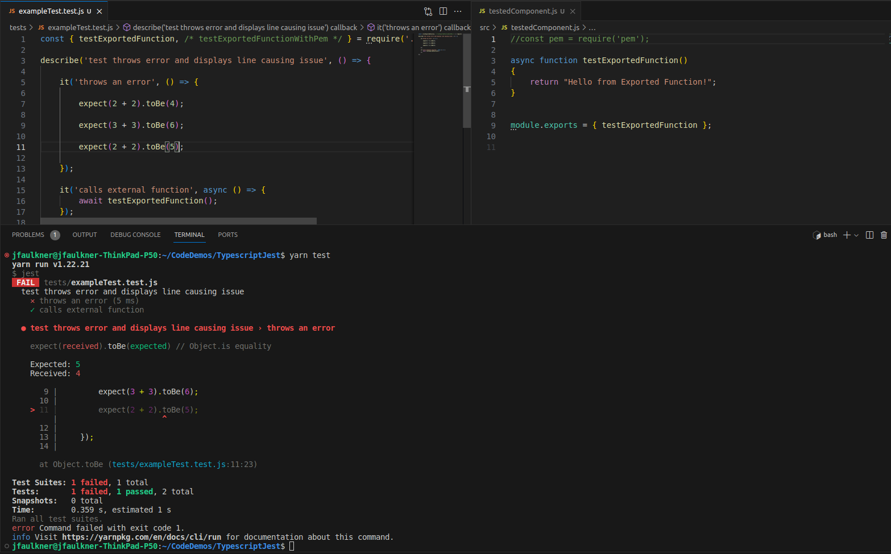
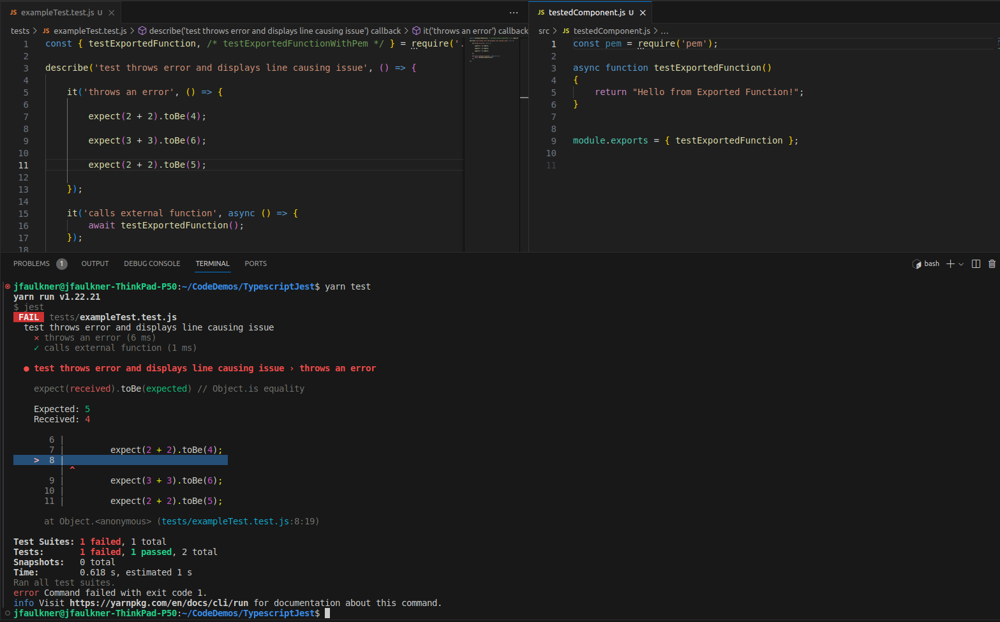

## Reproduce issue:
### Typescript Jest displays wrong line numbers when pem library is added to project
I'm having trouble resolving this issue so I've created a simple project to reproduce it.

```
yarn install
yarn test
```


Jest displays the correct line that causes test to fail.


When [pem](https://www.npmjs.com/package/pem) is added to the project, jest reports a failed test from exampleTest.test.ts  on the wrong line number (44)



My goal is to have Jest report the correct that causes a test to fail, even when the pem library is used by the project.

One requirement is that I need to use pem version 1.14.8 
At the moment, the @types library only goes up to version 1.14.4, which could be what's causing this problem. Not sure if there's a work around.
```json
  "dependencies": {
    "pem": "^1.14.8",
    "@types/pem": "^1.14.4"
  }
```
